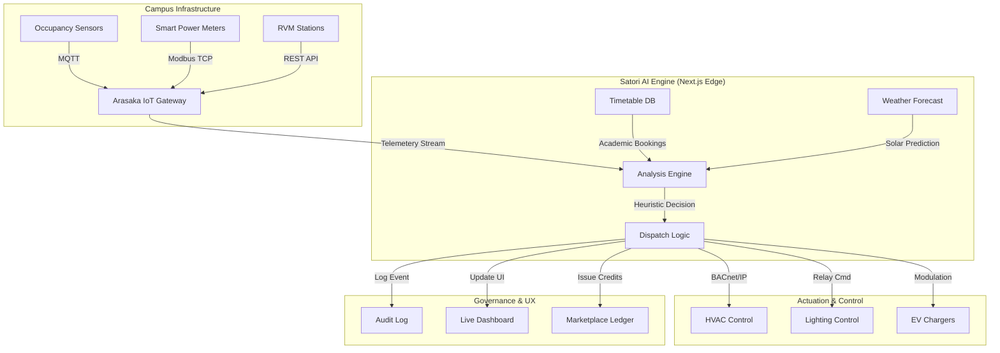

# Arasaka Energy OS: Institutional Smart Campus Framework

## 1. Executive Summary
Arasaka Energy OS is a high-fidelity, unified operating layer designed to manage energy consumption, on-site renewable generation, and circular utility assets within large-scale institutional environments. By integrating real-time telemetry from environmental sensors with centralized academic scheduling, the platform provides an autonomous decision engine that eliminates "Phantom Waste"—energy consumed in vacant but conditioned spaces. The system is engineered to deliver a 26.9% reduction in imported grid energy within 24 months, facilitating both fiscal resilience and ESG compliance.

## 2. Problem Statement and Opportunity
### 2.1 The Efficiency Gap in Higher Education
Large-scale campuses often suffer from disconnected utility management. While solar arrays and energy-efficient lighting may be present, they rarely operate in a coordinated manner. 
- **The Challenge**: HVAC and lighting systems are often left active in classrooms that are vacant due to schedule changes or early class dismissals.
- **The Data Point**: SRHU’s 2024–25 energy audit reports a baseline of 26,718,288 kWh in annual electricity use. Without orchestration, up to 15-20% of this consumption is estimated to be non-productive waste.

### 2.2 The Arasaka Opportunity
Arasaka Energy OS bridges this gap by creating a "Digital Twin" of campus energy flow. It treats every classroom, EV charger, and water cooler as a managed node in a campus-wide smart grid.

## 3. Competitive Analysis: Arasaka OS vs. Legacy BMS
Unlike traditional Building Management Systems (BMS) which rely on static schedules and siloed hardware, Arasaka OS is a dynamic, multi-modal operating system.

| Feature | Legacy BMS / Scada | Arasaka Energy OS | Institutional Advantage |
| :--- | :--- | :--- | :--- |
| **Scheduling Logic** | Static (Time-of-day) | Dynamic (Live Timetable Sync) | Prevents waste in canceled or rescheduled lectures. |
| **Energy Sourcing** | Passive (Grid-first) | Predictive (Solar-first Dispatch) | Prioritizes on-site renewables to minimize tariff costs. |
| **Student UX** | Non-existent | Integrated (Circular Rewards) | Institutionalizes sustainability through behavior change. |
| **Asset Silos** | Disconnected HVAC/Solar/EV | Unified Control Layer | Optimizes load-routing across all campus modules. |
| **Audit Logs** | Manual / Fragmented | Autonomous & Immutable | Provides auditable ESG telemetry for accreditation. |
| **Intelligence** | Reactive Alerts | Predictive Optimization | Forecasts solar yield and pre-cools rooms autonomously. |

## 4. Core System Architecture
The platform utilizes a structured six-layer logic stack for telemetry ingestion and autonomous actuation.

### 4.1 Data Flow Diagram (Mermaid)


## 5. Role-Based Feature Sets
Arasaka OS provides three distinct interfaces tailored to the needs of campus stakeholders.

### 5.1 Sustainability Officer Console (Strategic Oversight)
- **Global Scorecard**: Real-time monitoring of carbon-offset (tCO2e) and grid-savings metrics.
- **Autonomous Audit Log**: A transparent, immutable record of every autonomous decision made by the OS.
- **ESG Export Engine**: Automated generation of audit-ready compliance reports in CSV and PDF formats.

### 5.2 Facility Manager Workspace (Operational Accountability)
- **Asset Health Monitoring**: Live status and maintenance schedules for all connected hardware.
- **Automated Workflows**: OS-generated maintenance tickets triggered by hardware faults or energy anomalies.
- **Dynamic Drill-Down**: Per-block telemetry views for localized troubleshooting.

### 5.3 Student Resident Hub (Circular Economy)
- **Incentive Loop**: Verified recycling returns at RVM stations trigger immediate "Arasaka Credits."
- **Eco-Marketplace**: A redemption platform where credits are exchanged for campus services and perks.
- **Social Accountability**: Live leaderboards showing the sustainability performance of various campus residential blocks.

## 6. API Integration Reference
Arasaka OS exposes standardized endpoints for hardware integration. All requests must include an `X-Arasaka-Key` in the header.

### 6.1 Telemetry Ingestion
`POST /api/telemetry`
**Payload Example**:
```json
{
  "nodeId": "BLOCK_A_RM_402",
  "metrics": {
    "occupancy": true,
    "currentLoad": 4.2,
    "tempCelsius": 24.5
  },
  "timestamp": "2026-04-29T10:00:00Z"
}
```

### 6.2 Recycling Event Verification
`POST /api/recycling/submit`
**Payload Example**:
```json
{
  "rvmId": "CANTEEN_01",
  "material": "PET_BOTTLE",
  "studentId": "AR_9921",
  "verificationHash": "0x5f3a..."
}
```

## 7. Hardware Compatibility Matrix
| System Category | Supported Protocols | Certified Hardware (Examples) |
| :--- | :--- | :--- |
| **BMS / HVAC** | BACnet/IP, Modbus TCP | Siemens Desigo, Schneider EcoStruxure |
| **Electrical Metering** | MQTT, Pulse-Output | Elmeasure, Schneider iEM Series |
| **Environment Sensing** | Zigbee 3.0, LoRaWAN | Arasaka Node-S1, Netatmo Pro |
| **EV Infrastructure** | OCPP 1.6J, 2.0.1 | Delta CityCharger, ABB Terra |

## 8. The 24-Month Implementation Roadmap
The deployment is sequenced into three waves to ensure operational stability and data validation.

### Wave 1: Immediate Controllable Loads (Months 0–8)
Focus: Smart classroom controls, 1.2 MWp parking canopy solar, and RVM circular nodes.
Target: 10.7% grid reduction.

### Wave 2: Residential Living Loads (Months 6–16)
Focus: Hostel infrastructure, including geyser scheduling, laundry peak-shifting, and corridor motion lighting.
Target: Cumulative 18.5% grid reduction.

### Wave 3: Deep Engineering Optimization (Months 12–24)
Focus: Central HVAC chiller plant optimization, laboratory airflow reset, and server-room cooling modulation.
Target: Final 26.9% cumulative grid reduction.

## 9. Technical Stack and Performance
- **Core Platform**: Next.js 14 utilizing the App Router for optimized server-side rendering.
- **State Management**: React Context API for cross-component role and telemetry synchronization.
- **Data Persistence**: Google Firebase Firestore for low-latency, real-time data streaming.
- **Security**: Firebase Authentication with custom claims for strict Role-Based Access Control (RBAC).
- **Interface Design**: Tailwind CSS and Framer Motion for high-fidelity UI state transitions.

## 10. Financial and Environmental Impact
- **Total CAPEX (Phases 1-3)**: Rs. 15.89 Crores.
- **Projected Net Benefit**: Rs. 4.11 Crores / year.
- **Payback Period**: 3.9 Years.
- **Annual Carbon Offset**: 5,141 tCO2e.

## 11. Glossary of Operational Terms
- **Phantom Waste**: Energy consumed in classrooms or laboratories that are active but unoccupied.
- **Solar-First Dispatch**: The OS logic that prioritizes on-site generation for mission-critical academic loads before utilizing grid power.
- **Satori AI Engine**: The core heuristic engine that reconciles timetable data with live sensor telemetry to automate load-shedding.
- **Circular Credits**: Digital assets earned by students through verified sustainable behaviors, redeemable within the campus economy.

---
**Lead**: Ananay Dubey, Ayushman Nayak  
**Revision Date**: April 29, 2026
